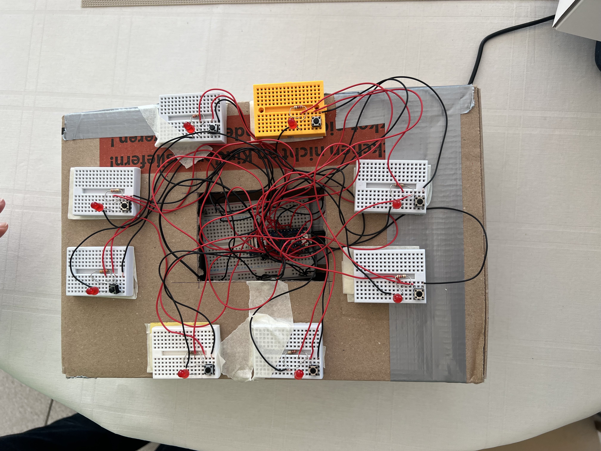
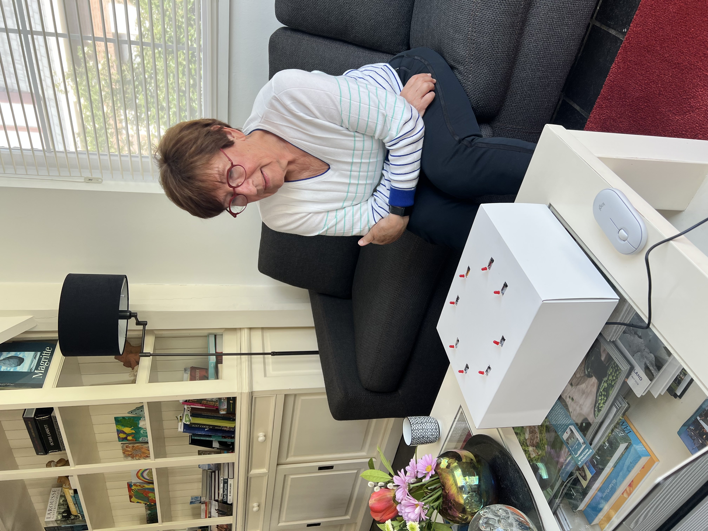
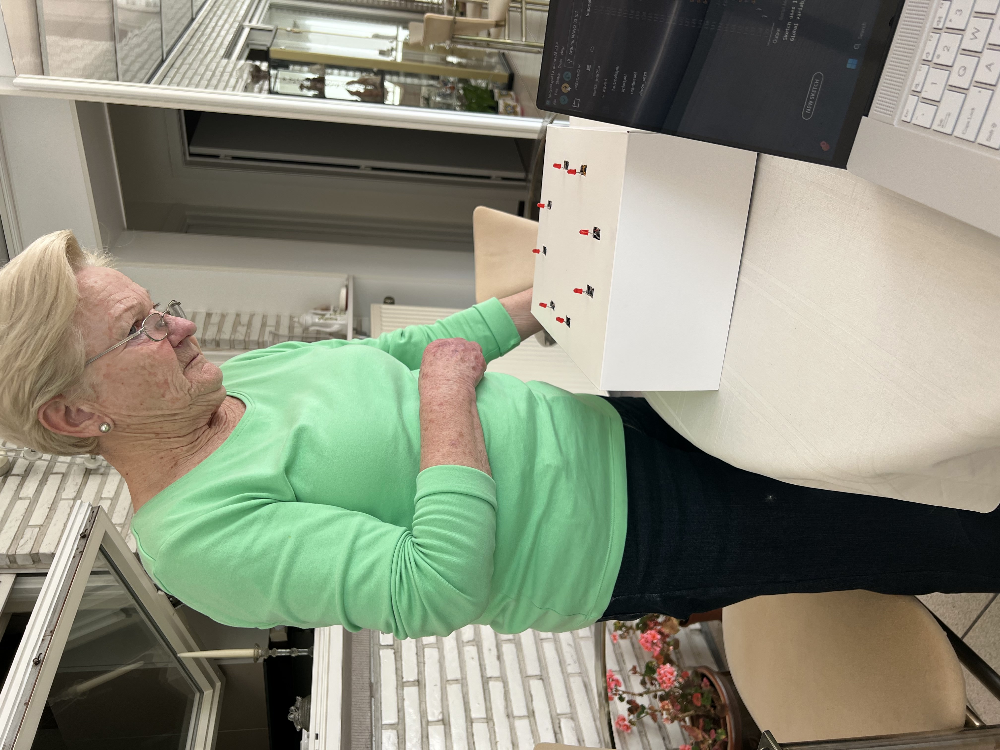
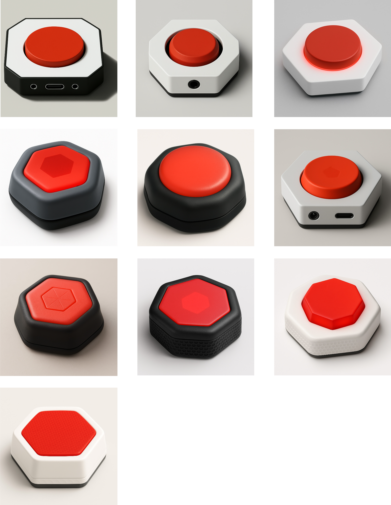

# LumiLife

**LumiLife – Interactieve stimulatiepads voor ouderen**

LumiLife stimuleert ouderen op een toegankelijke en plezierige manier om zowel fysiek als mentaal actief te blijven via interactieve, verlichte drukpads die spelenderwijs beweging en geheugen ondersteunen.

**Team**  
Florine De Spiegeleer  
Baptiste Braekevelt

**Datum**  
22 mei 2025

---

## Samenvatting

LumiLife is een reeks interactieve, lichtgevende pads ontworpen om ouderen op een toegankelijke en motiverende manier fysiek en cognitief te stimuleren. Ouderen kampen vaak met verminderde mobiliteit, geheugenverlies en een gebrek aan speelse beweegmomenten, zowel in woonzorgcentra als thuis. Bestaande oplossingen zijn vaak technisch complex of onvoldoende afgestemd op hun noden. LumiLife biedt hiervoor een laagdrempelig alternatief dat spel, beweging en geheugen traint combineert in één product.

Via ritmisch oplichtende pads worden ouderen uitgedaagd om te reageren, patronen te onthouden of verschillen op te sporen. De pads kunnen zittend of staand gebruikt worden. Dankzij eenvoudige bediening, duidelijke visuele feedback en aanpasbare moeilijkheidsgraden sluit het systeem aan bij uiteenlopende gebruikersprofielen. Het ontwerp werd iteratief getest en verfijnd met ouderen, waarbij spelplezier, comfort en begrijpelijkheid centraal stonden.

LumiLife onderscheidt zich door zijn speelse benadering, modulaire opbouw en uitnodigende vormgeving. Het product verlaagt de drempel tot beweging, bevordert hersenactiviteit en creëert nieuwe mogelijkheden voor sociale en fysieke interactie bij ouderen.

 
 

Figuur 1 & 2: Sketch van de pads en mockup van de interface

---
## Introductie

De wereldwijde vergrijzing brengt een toenemende vraag naar innovatieve oplossingen voor de uitdagingen van ouder worden. In België heeft 10% van de 65-plussers mobiliteitsproblemen, en dit percentage neemt aanzienlijk toe naarmate de leeftijd vordert. Daarnaast kampt 10% van de 65-plussers, 20% van de 80-plussers en zelfs 40% van de 90-plussers met geheugenverlies of dementie ([Expertisecentrum Dementie Vlaanderen](https://www.dementie.be/home/wat-is-dementie/prevalentie/)). Wereldwijd wordt er om de drie seconden bij iemand de diagnose dementie gesteld ([Alzheimer’s Disease International, z.d.]([https://www.scribbr.nl/category/apa-stijl/](https://www.alzint.org/about/dementia-facts-figures/dementia-statistics/))). Afbeelding 1 illustreert de verwachte toename van het aantal mensen met dementie wereldwijd tussen 2019 en 2050, zoals gerapporteerd door de WHO ([Alzheimer’s Disease International, 2021](https://www.alzint.org/news-events/news/who-launches-its-global-status-report-on-the-public-health-response-to-dementia/)). Deze cijfers benadrukken de dringende noodzaak om ouderen op een toegankelijke en motiverende manier fysiek en mentaal te ondersteunen.

Figuur 3: Verwachte groei van het aantal mensen met dementie wereldwijd van 2019 tot 2050. ([Alzheimer’s Disease International, 2021](https://www.alzint.org/news-events/news/who-launches-its-global-status-report-on-the-public-health-response-to-dementia/))

LumiLife biedt een innovatieve oplossing voor deze uitdaging. Met een set interactieve pads die licht- en geluidssignalen gebruiken, combineert LumiLife fysieke en cognitieve stimulatie. De pads zijn ontworpen om eenvoudig en speels te gebruiken, zowel thuis als in woonzorgcentra. Door ouderen te motiveren actief te blijven, bevordert LumiLife niet alleen hun mobiliteit en reactiesnelheid, maar draagt het ook bij aan hun mentale veerkracht en algehele levenskwaliteit. Dit maakt LumiLife tot een waardevol hulpmiddel in de ondersteuning van ouderen in hun dagelijkse leven.

---
## Methodologie

Het ontwerptraject van LumiLife werd uitgevoerd volgens een gestructureerd ontwerpparadigma gebaseerd op het **Triple Diamond-model**, een uitbreiding op het klassieke Double Diamond-model. Dit model omvat drie opeenvolgende fasen: *Discovery*, *Definition* en *Development*, die telkens een afwisseling van divergent en convergent denken faciliteren. Deze fasering diende als kapstok voor het volledige project en ondersteunde een iteratief proces van verkennen, conceptualiseren, bouwen en testen.  

### Discovery (Week 1–6)

De Discovery-fase richtte zich op het fundamenteel begrijpen van de doelgroep en context. Via een uitgebreide literatuurstudie werden fysieke en cognitieve uitdagingen bij ouderen onderzocht, evenals therapeutische principes zoals de Ronnie Gardiner Methode (RGM), die multisensorische stimulatie inzet via ritme en beweging. Parallel werd een benchmarking uitgevoerd van bestaande marktproducten om lacunes en opportuniteiten te identificeren.

Aanvullend werden diepte-interviews afgenomen met ouderen en therapeuten (zonder RGM-ervaring), met als doel hun noden, voorkeuren en barrières in kaart te brengen. Deze kwalitatieve inzichten werden geanalyseerd en vertaald naar ontwerpcriteria. Een "How Might We"-vraag werd geformuleerd als strategisch kader voor de rest van het traject.

### Definition (Week 6–12)

De tweede fase stond in het teken van het concretiseren van ontwerpvereisten en het exploreren van oplossingsrichtingen. Op basis van de verkregen inzichten werden meerdere low-fidelity concepten ontwikkeld en getest tijdens drie golven gebruikerstesten (N = 4–5 per test). De focus lag hierbij op gebruiksgemak, aantrekkelijkheid, spelplezier en begrijpelijkheid.  

Daarnaast werd een storyboard ontworpen om de volledige gebruikersflow visueel te communiceren. Deze visualisatie hielp bij het identificeren van kritische momenten in de interactie en ondersteunde besluitvorming tijdens het ontwerpproces.

### Development (Semester 2)

In de Development-fase werd het ontwerp iteratief verfijnd en technisch uitgewerkt. Deze fase werd opgedeeld in drie cycli, telkens met een duidelijke focus:

- **Develop 1**: Evaluatie van padvorm, interface en opbergsysteem met behulp van fysieke mock-ups
- **Develop 2**: Implementatie en test van vier elektronische spelconcepten op basis van LED-feedback en drukinteractie (via Arduino)
- **Develop 3**: Beoordeling van de visuele vormgeving en test van het finale prototype met werkende hardware en interface

Elke cyclus bestond uit prototyping, gebruikerstesten en terugkoppeling. Door systematisch feedback te verzamelen en te vertalen naar ontwerpverbeteringen werd het product stapsgewijs verfijnd tot een coherent en gebruikersgericht eindconcept.

Figuur 4: Storyboard

Figuur 5: Tijdlijn 

Door het gestructureerde verloop van deze fasen en het herhaaldelijk betrekken van de doelgroep, werd LumiLife ontwikkeld als een innovatieve en effectieve oplossing om ouderen fysiek en mentaal te ondersteunen.

---
## Discovery

### Doestellingen
De Discovery-fase richtte zich op het beantwoorden van de vraag: "Wat is het probleem en hoe kunnen we dit begrijpen?". Het doel was om diepgaand inzicht te verkrijgen in de behoeften, uitdagingen en gedragingen van de doelgroep, met name ouderen, en hoe deze met fysieke en cognitieve beperkingen omgaan. Specifiek werd er gestreefd naar:
* In kaart brengen van mobiliteits- en geheugenproblemen bij ouderen.
* Onderzoeken van bestaande methodes en technologieën die fysieke en cognitieve stimulatie bevorderen, waaronder de Ronnie Gardiner Methode (RGM).
* Identificeren van mogelijkheden om een toegankelijk product te ontwikkelen dat ouderen motiveert tot actieve participatie.

### Materiaal & methoden
**"How Might We"-vraag**

Een "How Might We"-vraag werd geformuleerd om het onderzoek te kaderen:
Hoe kunnen we een interactieve, multisensorische ervaring creëren voor ouderen die zowel hun cognitieve als fysieke gezondheid bevordert, terwijl het boeiend en gemakkelijk te gebruiken blijft?
Deze vraag definieerde de doelgroep, het probleem, de context en de technologische haalbaarheid. Ze diende als richtlijn voor alle onderzoeksactiviteiten.

**Literatuuronderzoek**

Een literatuurstudie werd uitgevoerd om inzicht te krijgen in:
* Mobiliteits- en cognitieve uitdagingen bij ouderen.
* De Ronnie Gardiner Methode (RGM) en vergelijkbare technieken.
Het literatuuronderzoek volgde een gestructureerd protocol waarbij databases en relevante wetenschappelijke artikelen werden geraadpleegd. De resultaten werden samengevat in een rapport dat als basis diende voor verdere beslissingen.

**Interviews**

Interviews werden afgenomen om waardevolle inzichten te verkrijgen in de behoeften van ouderen en professionals:
* Twee interviews met ouderen, waarvan één persoon ervaring had met cognitieve stimulatie en één niet, maar wel regelmatig oefeningen doet.
* Eén interview met een kinesist die werkt met ouderen, maar nog geen ervaring heeft met de Ronnie Gardiner Methode (RGM).
Voorafgaand aan de interviews werden protocollen opgesteld en a.d.h.v. een informed consent gevraagd om toestemming te verkrijgen voor deelname en het gebruik van de verzamelde gegevens. De gegevens uit de interviews werden zorgvuldig geanalyseerd om thema’s en patronen te identificeren die relevant zijn voor het ontwerp van de oplossing.

**Benchmarking**

Er werd een benchmarking uitgevoerd van bestaande producten die fysieke en cognitieve stimulatie combineren. Dit omvatte onder andere:
* Moto Tiles
* BlazePods
* Thera-Trainer Senso
De producten werden geanalyseerd op aspecten zoals functionaliteit, gebruiksgemak, prijs en multisensorische feedback.

**Tools en Materialen**
* Onderzoeksprotocollen: Voor zowel het literatuuronderzoek als de interviews werden gedetailleerde protocollen opgesteld in Word om het onderzoek gestructureerd te laten verlopen.
* Rapportage: De resultaten en bevindingen van de verschillende methoden werden geanalyseerd en samengevat in rapporten, opgesteld met Microsoft Word. Voor het verwerken en organiseren van kwantitatieve en kwalitatieve gegevens werd gebruik gemaakt van Microsoft Excel.
* Opnames: Tijdens de interviews werd gebruik gemaakt van Word Dictate om audio-opnames te maken, wat zorgde voor een efficiënte verwerking en analyse van de gesprekken.
* Analysemodellen: Het onderzoek werd ondersteund door methoden zoals root-cause analysis om fundamentele problemen te identificeren en de Innovatrix om oplossingen te verkennen en te evalueren.

### Resultaten
**How Might We"-vraag**
De "How Might We"-vraag werd geformuleerd om het onderzoek te kaderen en richten: "Hoe kunnen we een interactieve, multisensorische ervaring creëren voor ouderen die zowel hun cognitieve als fysieke gezondheid bevordert, terwijl het boeiend en gemakkelijk te gebruiken blijft?"
De vraag definieert:
* Doelgroep: Ouderen die te maken hebben met verminderde mobiliteit of een cognitieve achteruitgang.
* Probleem: Cognitieve achteruitgang en fysieke inactiviteit komen veel voor bij oudere mensen, wat leidt tot gezondheidsrisico's zoals geheugenverlies en slechte motoriek.
* Context: Deze oplossing kan worden toegepast in zorginstellingen, thuisomgevingen of revalidatiecentra.
* Waarom: Met een groeiende vergrijzing is er een dringende behoefte aan oplossingen die fysieke en cognitieve oefeningen combineren om het welzijn van ouderen te bevorderen.
De "How Might We"-vraag fungeerde als richtlijn om onderzoeksvragen en ontwerpeisen helder te formuleren. 

**Belangrijke bevindingen uit het literatuuronderzoek:**
* Effectiviteit van ritme en muziek: Ritmische bewegingen en muziek verbeteren cognitieve functies zoals geheugen en balans, zoals aangetoond in studies over de Ronnie Gardiner Methode (RGM). Deze methode combineert multisensorische prikkels met fysieke activiteit​
* Cognitieve en fysieke dual-tasking: Het gelijktijdig uitvoeren van fysieke en cognitieve taken leidt tot verbeterde motorische en mentale vaardigheden, wat de kern vormt van het concept​
* Motivatie en personalisatie: Gebruikers reageren beter wanneer activiteiten aansluiten bij hun persoonlijke voorkeuren, vooral bij muziek. Dit benadrukt het belang van aanpasbaarheid in het ontwerp​
Details zijn te vinden in het literatuuronderzoek protocol ([literatuuronderzoek protocol](https://1drv.ms/w/c/9458d939536e9058/EeYX1FP0L-lAgm024h_cDNcBPWpA-TumwWbAEvHtPe6b6w?e=PJB6Yb)) en het literatuuronderzoekrapport in de bijlage ([literatuuronderzoekrapport](https://1drv.ms/w/c/9458d939536e9058/EWQz_9QD8dpBpTh8NQzMlokB5SeG6wV0K6LT6gMB9irLHA?e=O8cmlj)).

**Inzicht uit de interviews:**
* Eenvoud en toegankelijkheid: Ouderen prefereren intuïtieve technologieën die gemakkelijk te begrijpen zijn. Complexiteit werkt ontmoedigend​
* Multisensorische feedback: Licht en subtiele geluiden worden gewaardeerd, maar overstimulatie moet worden vermeden. Dit geldt vooral bij cognitieve uitdagingen zoals balans- en geheugenproblemen​
* Zelfstandigheid en motivatie: Variatie in oefeningen en autonomie zijn belangrijk voor motivatie en consistent gebruik​
Zie interviewrapporten ([interviewrapport](https://1drv.ms/w/c/9458d939536e9058/ER6nH3z0XeFKuMaCuIisP8YBIFPhPJLEmsiKt6eIfM8fhg?e=8cAQuv))en protocollen ([interview protocol](https://1drv.ms/w/c/9458d939536e9058/EWRbjy3uARlLg2ORJMHx51kB_5V5LIPIr9IfjHXqO9-4yA?e=10Dczc))in de bijlage voor een uitgebreide analyse.

**Bevindingen uit Benchmarking:**

Uit benchmarking van producten zoals Moto Tiles, BlazePods, en Thera-Trainer Senso kwamen de volgende inzichten:
* Multisensorische interacties: Deze producten gebruiken licht en geluid om fysieke en cognitieve uitdagingen te combineren.
* Kosten en complexiteit: Veel concurrerende producten zijn duur en vereisen vaak een operator, wat ze minder geschikt maakt voor zelfstandig gebruik door ouderen.
Details zijn te vinden in het benchmarking rapport ([benchmarking rapport](https://1drv.ms/w/c/9458d939536e9058/EQlW4kpImIJMtvqYNZ5XCkoBC6DovXtIstasZ4E2wJtfuw?e=PyZ9mh)).

### Conclusies & implicaties
De Discovery-fase leverde cruciale inzichten op voor het ontwerp van een toegankelijk product dat ouderen zowel cognitief als fysiek ondersteunt. Multisensorische interactie, zoals visuele, auditieve en tactiele feedback, werd geïdentificeerd als essentieel om betrokkenheid en effectiviteit te verhogen. Daarnaast is het ontwerp gericht op eenvoud en aanpasbaarheid, zodat gebruikers met verschillende niveaus van mobiliteit en cognitie het gemakkelijk kunnen gebruiken. Ritmische stimulatie, geïnspireerd door de Ronnie Gardiner Methode, bleek een waardevol therapeutisch middel om motoriek en geheugen te verbeteren. Tot slot benadrukten benchmarking en literatuuronderzoek het belang van kosteneffectiviteit en gebruiksgemak om het product breed inzetbaar te maken.

---
## Definition

### Doestellingen
De Definition-fase was gericht op het vertalen van de inzichten uit de Discovery-fase naar concrete concepten en ontwerpeisen. Het hoofddoel was het ontwikkelen van een onderbouwd en uitvoerbaar ontwerpconcept dat zowel cognitieve als fysieke stimulatie voor ouderen combineert. Specifiek werd er gestreefd naar:
* Het vaststellen van duidelijke productdoelstellingen en -vereisten gebaseerd op gebruikersinzichten.
* Het ontwerpen en evalueren van low-fidelity prototypes om de haalbaarheid en aantrekkelijkheid van het concept te testen.
* Het identificeren en prioriteren van essentiële functies die het product effectief, gebruiksvriendelijk en toegankelijk maken.

### Materiaal & methoden
Gebaseerd op de Discovery-fase werden de belangrijkste ontwerpeisen opgesteld. Deze werden geïnspireerd door de "How Might We"-vraag en inzichten uit literatuuronderzoek, interviews en benchmarking. Het doel was om een helder kader te creëren voor de ontwikkeling van prototypes en concepten.

**Storyboarding** 

De eerste stap bestond uit het opstellen van een storyboard om de gebruikersflow en de mogelijke interacties met het product visueel te maken. Dit storyboard diende als leidraad bij de planning en uitvoering van de gebruikerstesten.

Om een goed product te ontwikkelen, werd een iteratief proces van drie waves van gebruikerstesten opgezet. Het doel van deze waves was om steeds verfijndere inzichten te krijgen en verbeteringen aan te brengen in het ontwerp op basis van gebruikersfeedback.

**Voorbereiding** 

Voor elke gebruikerstest werden protocollen opgesteld om de structuur en consistentie van de tests te waarborgen. Bovendien werd informed consent gevraagd aan de deelnemers om toestemming te verkrijgen voor deelname en het gebruik van de verzamelde gegevens. Dit proces zorgde ervoor dat de ethische normen werden nageleefd.

**Uitvoering van de tests** 

De gebruikerstesten vonden plaats in een gecontroleerde omgeving en werden semi-gestructureerd uitgevoerd. Tijdens de tests werden:
* Observaties gedaan van fysieke reacties en non-verbale signalen.
* Interviews afgenomen na afloop van de tests om kwalitatieve feedback te verzamelen.
* Notities en foto’s gemaakt om alle relevante inzichten vast te leggen.

**Analyse en rapportage**

Na elke gebruikerstest werd de verzamelde data geanalyseerd en samengevat in een rapport (opgesteld in Word). Deze rapporten bevatten gedetailleerde beschrijvingen van de feedback, observaties en interviews, en werden gebruikt om verbeterpunten te identificeren.

**Iteratieve verbeteringen**

De kennis en inzichten uit elke test werden gebruikt om nieuwe, betere prototypes te ontwikkelen voor de volgende wave. Dit iteratieve proces zorgde ervoor dat het product bij elke stap meer aansloot op de behoeften en voorkeuren van de gebruikers.

### Resultaten

#### Wave 1

In Wave 1 van dit project waren er twee respondenten (N=2), en de eerste gebruikerstest gaf waardevolle inzichten over de fysieke interactie en de voorkeuren voor de interface van ouderen, zoals **de vorm en grootte van de pads**.
* Vorm: Hexagonale pads werden geprefereerd vanwege hun stabiliteit en gebruiksgemak. Ronde pads gleden vaak weg en werden minder praktisch gevonden.

 
Figuur 6: Vorm van de pads

* Grootte: Kleinere en middelgrote pads waren favoriet. Deze formaten zijn handzaam en geschikt voor ouderen met beperkte kracht en mobiliteit​

 
Figuur 7: Grootte van de pads

**Spelervaring en mechanismen**
* Bij "Simon Says" werd het behouden van eerdere kleuren in de volgorde als nuttig ervaren.
* Gebruikers waardeerden de mogelijkheid om de snelheid en moeilijkheidsgraad aan te passen.
* Bij "Memory" benadrukten gebruikers het belang van visuele feedback bij foutieve keuzes om hun geheugen te trainen​

Zie de spelletjes die tijdens de gebruikerstesten werden ingezet op de Scratch-projectpagina.
* Memory: ([memory 2s](https://scratch.mit.edu/projects/1105844361))([memory 4s](https://scratch.mit.edu/projects/1105841443))([memory 6s](https://scratch.mit.edu/projects/1105627585))
* Simon Says: ([blijvend](https://scratch.mit.edu/projects/1105530454))([afzonderlijk](https://scratch.mit.edu/projects/1105490436))

**Gebruiksscenario's**
* Zittend gebruik bleek essentieel, aangezien deelnemers in woonzorgcentra geen oefeningen rechtstaand konden uitvoeren​

**Algemene observaties**
* Duidelijke en eenvoudige spelregels, zowel visueel als auditief, waren noodzakelijk.
* Gebruikers waardeerden positieve aanmoediging en korte oefeningen om betrokken te blijven.

Zie het rapport voor een volledige analyse ([gebruikerstest rapport - Wave 1](https://1drv.ms/w/c/9458d939536e9058/ETyzMVBTAqpOuSBb_r_y764BASb1ogtXWAj5bsVuHbbHAg?e=OtncXO)).

#### Wave 2

De tweede gebruikerstest richtte zich op de optimalisatie van **de interface**, verschillende **spelvarianten** en **opbergmethoden**, waarbij vier respondenten (N=4) betrokken waren.

**Interface-optimalisatie**
* Lay-out A (kleurrijke interface met icoontjes): Positief ontvangen vanwege de visuele aantrekkingskracht, hoewel icoontjes soms overbodig werden gevonden.

 
Figuur 8: Lay-out kleurrijke interface met icoontjes

* Lay-out B (zwart-wit): Rustig en leesbaar, maar minder uitnodigend voor sommige gebruikers.

 
Figuur 9: Lay-out zwart-wit

* Lay-out C (kleurrijke interface zonder icoontjes): Eenvoudig en aantrekkelijk, hoewel sommige kleuren minder zichtbaar waren​

 
Figuur 10: Lay-out licht blauw

**Spelvarianten**

Reactiespel: Gebruikers waardeerden de uitdaging, maar foutmeldingen (rood licht) veroorzaakten frustratie doordat er geen duidelijke toelichting werd gegeven.
Muzikale volgorde: Het gebruik van muziek werd positief ontvangen, maar er ontstond verwarring over de spelregels: zoals het onderscheid tussen een lange druk op een knop en meerdere korte drukken.
Bomspel: Het spel was te complex en ontmoedigend en had demotiverende effect van opnieuw moeten beginnen bij een fout bij sommige gebruikers​.

Zie de spelletjes die tijdens de gebruikerstesten werden ingezet op de Scratch-projectpagina.
* Reactiespel: ([reactiespel](https://scratch.mit.edu/projects/1108515084))
* Muzikale volgorde: ([broeder Jacob](https://scratch.mit.edu/projects/1108770480))
* Bomspel: ([oversteek](https://scratch.mit.edu/projects/1108045979))

**Feedback en motivatie**
* Auditieve feedback, zoals muziek en verbale aanmoediging, werd als stimulerend ervaren.
* Visuele feedback (groen voor succes, rood voor fouten) hielp gebruikers beter begrijpen wat goed of fout was​.

**Opbergmethoden**
* Het stapelsysteem werd praktisch bevonden, hoewel het onhandig was voor gebruikers met beperkte handkracht.
* Het ophangsysteem op de muur werd gewaardeerd om zijn motiverende effect, maar stabiliteit van de gebruiker bleef een aandachtspunt.

 
 
Figuur 11 & 12: ophangsysteem op muur 

* De draagkoffer werd als te zwaar beschouwd.

Zie het rapport voor een volledige analyse ([gebruikerstest rapport - Wave 2](https://1drv.ms/w/c/9458d939536e9058/EQAoYSECcCZIl89DBi5uTBwBhS_ndjKiyS1uXfosK8tKcw?e=wQepgM)).

#### Wave 3

**Doelstellingen**

In Wave 3 waren er drie respondenten (N=3) die betrokken waren om aanvullende inzichten te verkrijgen. De gebruikerstesten in de Definition-fase richtte zich op het verder verfijnen en valideren van het concept. Het hoofddoel was om te onderzoeken of het product daadwerkelijk een probleem oplost voor ouderen en hoe het geoptimaliseerd kan worden voor de uiteindelijke doelgroep. Specifiek waren de doelstellingen:

* Het valideren van de aantrekkelijkheid, functionaliteit en effectiviteit van het concept.

* Het verkrijgen van diepgaand inzicht in hoe ouderen omgaan met het product in een realistische setting.

* Het identificeren van eventuele resterende barrières en verbeterpunten.

**Materiaal & methoden**

Gebruikersgroep: Voor de derde wave werden drie oudere deelnemers geselecteerd (leeftijd 65-70 jaar) die eerder interesse toonden in technologie en spellen. Deze groep bood een representatief beeld van de doelgroep.

Voorbereiding: De prototypes die werden gebruikt, waren verbeterde versies gebaseerd op de feedback uit de eerste twee waves. De belangrijkste verbeteringen waren:

* Geoptimaliseerde spelregels en visuele feedback.

* Een stabielere fysieke structuur van de pads.

* Een aangepaste interface met grotere knoppen en verbeterde kleurencontrasten.

Uitvoering van de tests: De tests werden uitgevoerd in de vertrouwde omgeving van de deelnemers om realistische interacties te observeren. De methoden omvatten:

Observatie: Non-verbale reacties en fysieke interacties werden geanalyseerd.

Semigestructureerde interviews: Open vragen werden gesteld om inzichten te verzamelen over gebruiksgemak, spelplezier en verbeterpunten.

Feedbackformulieren: Deelnemers vulden een korte vragenlijst in over hun algemene ervaring.

**Algemene feedback**

* Deelnemers vonden het product een nuttige en leuke manier om zowel fysiek als mentaal actief te blijven.

* Korte sessies van 10-15 minuten werden als ideaal beschouwd.

* De draagbaarheid van de pads en het gemak van opbergen bleven aandachtspunten.

**Conclusie en aanbevelingen**

De derde wave van gebruikerstesten bevestigde dat het concept aansluit bij de behoeften van ouderen. Het product stimuleert zowel fysieke als cognitieve activiteit op een toegankelijke en plezierige manier.

Aanbevelingen voor verdere ontwikkeling:

1. Optimaliseer de draagbaarheid van de pads, bijvoorbeeld door een lichter materiaal te gebruiken.

2. Voeg een volumeregeling toe voor de auditieve feedback.

3. Overweeg meer spelvarianten die zowel individueel als in groepsverband gespeeld kunnen worden.

4. Ontwikkel een handleiding met visuele en eenvoudige instructies om zelfstandig gebruik te ondersteunen.

Zie het rapport voor een volledige analyse ([gebruikerstest rapport - Wave 3](https://ugentbe-my.sharepoint.com/:w:/g/personal/baptiste_braekevelt_ugent_be/EQKbyQ5XPVJLrybpckSG4dUBGQ-3FgQxPabmIXJJkcQ6sw?e=UkvHKF)).

Je vindt de Definition template hier in de bijlage ([Definition template](https://www.figma.com/design/Cy5q6bLcNbuYPB8e8v4Wj1/Untitled?node-id=0-1&p=f&t=RWDK0Pis2ZzK7HZx-0))

### Conclusies & implicaties
De gebruikerstesten benadrukten het belang van eenvoud en toegankelijkheid in het ontwerp. Spelregels moeten intuïtief en duidelijk zijn om frustratie te voorkomen, en fouten mogen niet leiden tot demotivatie. Ritmische en multisensorische feedback blijft een essentieel element om zowel fysieke als cognitieve stimulatie te waarborgen.

---
## Develop 1: Interface en Opslagsystemen

### Doelstellingen

In deze eerste ontwikkelfase werd gefocust op het optimaliseren van de fysieke, cognitieve en sensoriële ergonomie van de LumiLife-stimulatiepads. De nadruk lag op het testen en verfijnen van drie cruciale productaspecten:

1. **Fysieke ergonomie**: Onderzoeken hoe ouderen interageren met de pads in zowel zittende als staande positie, met aandacht voor comfort, houding en bewegingsbereik.
2. **Opslagsystemen**: Vergelijken van drie opbergprototypes op vlak van gebruiksgemak, esthetiek en praktische toepasbaarheid in een woonzorgcontext.
3. **Interfaceontwerp**: Toetsen of theoretisch onderbouwde UX-principes voor ouderen ook in de praktijk geprefereerd worden, aan de hand van visuele vergelijkingen tussen verschillende interface-elementen.

### Materiaal en methoden

**Aantal respondenten**: N = 4  
**Doelgroep**: Ouderen van 65–70 jaar, twee uit een woonzorgcentrum en twee die zelfstandig wonen.  
**Locatie**: Woonzorgcentrum Heilig Hart en thuisomgevingen  
**Duur per sessie**: Ongeveer 30 minuten  

#### Voorbereiding

Voorafgaand aan de gebruikerstesten werd een literatuuronderzoek uitgevoerd naar UX-ontwerpprincipes voor oudere volwassenen. Tijdens de gebruikerstest (N = 4) kregen de deelnemers per aspect telkens twee visueel uitgewerkte varianten te zien. Ze werden gevraagd om op basis van persoonlijke voorkeur aan te duiden welke versie ze het meest leesbaar, duidelijk of aantrekkelijk vonden. De elementen die geëvalueerd werden, omvatten:
- Twee typografische stijlen (groot/vet vs. klein/standaard)
- Twee knopvormen (groot/afgerond vs. smal/rechthoekig)
- Twee kleurcombinaties (hoog vs. laag contrast)
- Twee lay-outopzetten (luchtig gespreid vs. compact)
Het document dat gebruikt werd tijdens de gebruikerstesten, met de resultaten van het literatuuronderzoek vindt u ([hier](https://1drv.ms/w/c/9458d939536e9058/EalpHkAlwedOk8uQsMz_srsBpAp_RENM4rBhBhqwPlnYFg?e=mT8cuu)) terug. 

Om de bruikbaarheid van LumiLife in verschillende woonomgevingen te testen, werden drie prototypes ontwikkeld voor het opbergen van de pads. Elk systeem exploreert een andere benadering van functionaliteit, esthetiek en ergonomie:

1. **Magnetisch whiteboard** – een functioneel, modulair systeem waarbij pads snel bevestigd en verwijderd kunnen worden.
2. **Honingraatstructuur** – een decoratief opbergsysteem met geometrische vormgeving dat inspeelt op visuele ordening.
3. **Schilderijframe** – een geïntegreerde wandoplossing waarbij de pads rond een kunstwerk worden geplaatst, wat zorgt voor esthetische meerwaarde en speelse interactie.

Figuur 13, 14 en 15: Ophangsysteem
Deze drie varianten werden getest op gebruiksgemak, stabiliteit en voorkeur bij ouderen. De foto’s hieronder illustreren elk prototype.

#### Uitvoering van de tests

De testopzet bestond uit drie delen:

1. **Interactieve pads – zittend vs. staand gebruik (15 min)**
   - Deelnemers voerden een geheugenspel uit met kleurvolgorde zowel zittend als staand.
   - Observaties: houding, bereikbaarheid, interactiestijl en tekenen van ongemak.

2. **Opslagsystemen (10 min)**
   - De deelnemers testten elk ophangsysteem afzonderlijk. Er werd ook gekeken naar hoe snel de begruikers intuitief doorhadden hoe het ophangsysteem werkt.
   - Observaties: snelheid, hanteerbaarheid, voorkeur.

3. **Interfacebeoordeling (5 min)**
   - De deelnemers kregen verschillende interfacevarianten voorgelegd (kleur, tekststijl, knoppen) en werden gevraagd hun favoriet aan te duiden.
   - Observaties: voorkeuren, herkenning, leesbaarheid.

Tijdens elke sessie werd gebruik gemaakt van observaties, notities, en een kort interview. Alle deelnemers tekenden vooraf het informed consent.

### Resultaten

#### Interactie met de pads – zittend gebruik

Tijdens het testen in zittende positie werd vooral gelet op comfort, bereikbaarheid en natuurlijke houding. De deelnemers kregen vooraf de mogelijkheid om de pads naar een voor hen comfortabele plek te verplaatsen, maar opvallend genoeg maakte niemand hiervan gebruik. Wel voelden de deelnemers vóór de start aan de verste en dichtstbijzijnde pads om de toegankelijkheid in te schatten. Dit gedrag suggereert dat ouderen zich spontaan aanpassen aan het standaardaanbod, zolang het binnen hun fysieke bereik valt.

De observaties toonden subtiele maar relevante verschillen tussen gebruikers. Eén deelnemer zat verder van de pads en moest de rug losmaken van de rugleuning om de verste pads aan te raken. Ondanks een eerdere schouderoperatie kon zij de buitenste pads nog vlot bereiken, zonder spanningen in pols of arm. Een tweede deelnemer zat juist dichter bij de tafel, hoefde nauwelijks voorover te leunen, en vond automatisch een rusthouding waarbij de handen ontspannen op de bovenbenen lagen. Deze positie bleek ergonomisch optimaal en werd omschreven als “aangenaam natuurlijk”.

Een belangrijke bevinding was dat het plaatsen van de pads op een matige afstand ertoe leidt dat gebruikers hun bovenlichaam in rust kunnen houden. Hierdoor wordt overbelasting van schouders en rug vermeden bij herhaald gebruik. Dit inzicht ondersteunt het idee dat LumiLife perfect inzetbaar is in een zittende context, op voorwaarde dat de tafelhoogte en afstand correct zijn afgestemd op de gebruiker.

#### Interactie met de pads – staand gebruik

Het staand gebruik werd over het algemeen als “meer inspannend” maar tegelijk ook “activerend” omschreven. Beide deelnemers rapporteerden een gevoel van fysieke stimulatie dat ze als positief ervaarden. Eén gebruiker beperkte zich tot de dichtstbijzijnde pads, en drukte op die knoppen zelfs wanneer hetzelfde kleur elders oplichtte. Dit toont aan dat comfortzones een grote rol spelen in de fysieke actieradius van ouderen: ze kiezen spontaan voor het pad dat het minst ver verwijderd is, zelfs als dit ten koste gaat van de spelcorrectheid.

De andere deelnemer toonde net een tegenovergestelde strategie. Hij bewoog energiek mee, verplaatste zijn voeten, en draaide zijn romp om pads op grotere afstand te bereiken. Bovendien sprak hij de kleurvolgorde luidop uit in een ritmisch patroon alvorens te drukken – een aanpak die hij zelf beschreef als “helpend voor het onthouden van de volgorde”. Deze spontane gedragsvorm bevestigt dat ritme en beweging cognitieve processen kunnen ondersteunen, en dat de integratie van auditieve prikkels een waardevolle designkeuze is.

Niettemin brachten beide deelnemers ook enkele fysieke beperkingen aan het licht. Door de huidige plaatsing van de pads moesten gebruikers zich herhaaldelijk vooroverbuigen, wat leidde tot spanning in nek, schouders en onderrug. Ook de armpositie bleek niet optimaal: uitgestrekte armen richting de lage pads veroorzaakten vermoeidheid na meerdere herhalingen. De licht gebogen knieën boden enige steun, maar bleken onvoldoende om langdurige inspanning te compenseren.

Hieruit volgt dat staand gebruik zeker wenselijk is, vooral voor actievere gebruikers, maar enkel mits aangepaste hoogte- en wandpositionering van de pads. Idealiter worden de pads op borsthoogte geplaatst, zodat het bovenlichaam in een rechte lijn kan blijven.

#### Interface-evaluatie

De interface werd getest aan de hand van verschillende visuele ontwerpvarianten, telkens aangeboden in een tweekeuzemodel. Gebruikers beoordeelden elk element afzonderlijk op basis van duidelijkheid, aantrekkelijkheid en gebruiksgemak. De focus lag op typografie, kleurcontrast, knopvormen en lay-out.

- **Typografie**: Grote, vetgedrukte tekst werd unaniem verkozen boven dunnere of kleinere lettertypes. Deze keuze werd omschreven als “duidelijker voor de ogen” en “minder inspannend om te lezen”. Eén deelnemer merkte op dat hij in de kleinere tekst “details begon te missen”.

- **Kleurcontrast**: Knoppen met sterke kleurcontrasten – zoals witte tekst op donkerblauwe of zwarte achtergrond – werden als rustiger en leesbaarder ervaren. Varianten met gelijkaardige kleurtonen tussen tekst en achtergrond veroorzaakten verwarring of werden traag herkend. Eén deelnemer gaf aan “soms te twijfelen wat er op de knop stond” bij lage contrasten.

- **Kleurcodering**: De semantiek van kleur werd snel herkend. Groen werd geassocieerd met ‘doorgaan’ of ‘goed’, rood met ‘fout’ of ‘stoppen’. Deze natuurlijke interpretaties kwamen spontaan naar boven zonder uitleg. De combinatie van kleur en vorm bleek essentieel om snel beslissingen te nemen.

- **Knopgrootte en vorm**: De voorkeur ging uit naar grotere, afgeronde knoppen met voldoende witruimte ertussen. Smalle knoppen werden als “druk” of “onduidelijk” ervaren, en beperkten de precisie bij het aanraken.

- **Lay-out en hiërarchie**: Een ruimtelijke en overzichtelijke schermopbouw, waarbij elementen duidelijk gescheiden zijn, werd als rustgevend en intuïtief ervaren. Interfaces met te veel elementen of dicht bij elkaar geplaatste componenten veroorzaakten onzekerheid of visuele overbelasting.

Samenvattend bevestigde deze evaluatie de meeste principes uit het voorafgaand literatuuronderzoek. De doelgroep heeft baat bij een eenvoudig, visueel helder en logisch opgebouwd scherm, met nadruk op zichtbaarheid, herkenning en vertrouwde kleurcodes.

#### Opslag- en ophangsystemen

Tijdens het testen van de drie opberg- en ophangsysteemprototypes werd zowel de functionele bruikbaarheid als de emotionele beleving geëvalueerd. Elk systeem werd afzonderlijk getest op gemak, stabiliteit en gebruiksvriendelijkheid.

- **Magnetische muur met knoppen en schermoptie**: Dit systeem werd technisch functioneel bevonden, maar de gebruikers begrepen niet altijd meteen hoe het werkte. De schermfunctie bleef abstract zonder demonstratie. Bovendien werden pads vaak willekeurig terug op het bord geplaatst, zonder logica of vast patroon. De leerbaarheid was laag, ondanks het praktische potentieel.

- **Honingraatstructuur**: Deze visueel aantrekkelijke oplossing stimuleerde gestructureerde plaatsing. De meeste deelnemers legden de pads spontaan in lijnen of symmetrische vormen. Toch bleek het gebruiksgemak beperkt door de kleine magneten, die het correct bevestigen bemoeilijkten. Eén gebruiker gaf aan dat het “te precies” moest gebeuren, wat frustrerend werd.

- **Schilderijframe**: Dit prototype werd het meest positief onthaald. Eén gebruiker ging spontaan over tot een creatieve interpretatie waarbij pads figuren voorstelden (“de gele zijn sterren, de blauwe de hemel”). Dit leidde tot een gesprek over *The Starry Night* van Van Gogh. Andere gebruikers prezen de visuele integratie en het motiverende karakter van het frame. Zelfs wie minder creatief ingesteld was, gaf aan het systeem “aangenaam” en “mooi” te vinden. De visuele aantrekkelijkheid verhoogde duidelijk de betrokkenheid.

De resultaten tonen aan dat het opslagsysteem een cruciale rol speelt in de beleving van het product. Een opbergmethode is niet louter functioneel, maar kan ook bijdragen aan het motiveren, inspireren of kalmeren van gebruikers – zeker in een woonzorgomgeving waarin visuele prikkels belangrijk zijn.

### Conclusie en ontwerpimplicaties

De eerste ontwikkelfase van LumiLife leverde waardevolle inzichten op over hoe ouderen omgaan met fysieke, visuele en cognitieve interactie binnen het product. De gebruikerstesten bevestigen het belang van een geïntegreerde aanpak waarbij gebruiksgemak, motiverende elementen en esthetiek hand in hand gaan. 

**Fysiek gebruik** moet afgestemd zijn op de mogelijkheden én grenzen van de doelgroep. Zittend gebruik blijkt de meest comfortabele en laagdrempelige optie, met minimale fysieke belasting. Tegelijkertijd toont het enthousiasme bij staand gebruik dat er potentieel is voor activerende spelvormen, mits de ergonomie correct wordt afgestemd op lichaamshoogte en balans.

**De interface** moet visueel helder, intuïtief en rustgevend zijn. Oudere gebruikers hebben baat bij eenvoudige schermen met grote knoppen, vetgedrukte typografie en sterke kleurcontrasten. Het gebruik van semantisch herkenbare kleuren (zoals groen en rood) verhoogt niet alleen de bruikbaarheid, maar ook het zelfvertrouwen bij interactie. Een luchtige en overzichtelijke lay-out draagt bij aan een positieve gebruikerservaring.

**Opslagsystemen** vervullen meer dan een functionele rol: ze beïnvloeden de beleving, motivatie en zelfs creativiteit van gebruikers. Waar de magnetische muur praktisch maar onpersoonlijk aanvoelde, en de honingraatstructuur visueel ordelijk maar technisch beperkt was, bleek het schilderijframe verrassend stimulerend. De integratie van visuele esthetiek in een functionele component wekte spontaan emotie, verhaal en interactie op – een onverwacht krachtig designprincipe.

Voor meer details, zie het [Develop 1 - rapport](https://1drv.ms/w/c/9458d939536e9058/EWhR-tmCHptBiUysGQoVtIYB4nBNWtqoA-bsH1ej9FYUKQ?e=X24wHi) en het [testprotocol](https://1drv.ms/w/c/9458d939536e9058/EUS0uwE4PvFEjm2u7NHSTDQB72pJcFUFVLs8EOmPZHMsvA?e=jUdrhR).

---
## Develop 2: Elektronische Spelervaring en Feedbackmechanismen

### Doelstellingen

In de tweede ontwikkelfase lag de focus op het testen van de elektronische werking van de LumiLife-pads en het evalueren van vier concrete spelconcepten. De doelstelling was drievoudig:

1. **Gebruikservaring van elektronische interactie**: Nagaan hoe ouderen omgaan met LED-feedback en drukknoppen in een spelcontext.
2. **Begrijpelijkheid en spelplezier**: Evalueren hoe duidelijk de spelregels zijn en welke beleving elk spel oproept.
3. **Iteratief verbeteren op basis van feedback**: Detecteren van technische, visuele of spelinhoudelijke knelpunten en formuleren van aanbevelingen voor optimalisatie.

### Materiaal en methoden

**Aantal respondenten**: N = 4  
**Doelgroep**: Ouderen tussen 65 en 80 jaar, zonder mentale of fysieke beperkingen.  
**Locatie**: Thuisomgeving van de respondenten (regio Gent en Zwevegem)  
**Duur per sessie**: Ongeveer 50 minuten

#### Voorbereiding

Voor deze testfase werd een elektronisch prototype ontwikkeld op basis van een Arduino Nano, gekoppeld aan 9 breadboards met elk een LED en een drukknop. De visuele en auditieve feedback werd bewust eenvoudig gehouden om overprikkeling te vermijden. Een kartonnen behuizing zorgde ervoor dat de technische onderdelen onzichtbaar bleven, waardoor de gebruikers zich konden focussen op het spel. Hieronder is een afbeelding te zien van het prototype.  
 
Figuur 16 & 17: prototype spelvarianten

Vier interactieve spelletjes werden ontwikkeld en in dezelfde volgorde aangeboden:

1. **Reactiespel** – Druk zo snel mogelijk op de oplichtende pad.
2. **Simon Says** – Herhaal een steeds langer wordende kleurvolgorde.
3. **Foutzoekspel** – Zoek de pad die *niet* brandt.
4. **Opletspel** – Reageer zo snel mogelijk op een onverwacht lichtsignaal.
De gebruikte Arduino-code is [hier](https://1drv.ms/f/c/9458d939536e9058/Ekrx7HoWOF9Ch0Qm6PNlmDUBsAGSlaoXRvZhFeAR-V_O9A?e=00CaEL) opgenomen. De spelregels die tijdens de testfase gehanteerd werden, zijn gedetailleerd terug te vinden in het bijhorende [testprotocol](https://1drv.ms/w/c/9458d939536e9058/EXgDpYKNdM9EvrJvkd7Jm6wBwVAXnAeeC1VeggPRiwNnsg?e=ZTa6Es).

#### Uitvoering van de tests

Elke sessie volgde een vaste structuur waarin vier spellen na elkaar werden gespeeld en individueel geëvalueerd. Voor elk spel werden de spelregels mondeling toegelicht, waarna werd getest in welke mate deze duidelijk en begrijpelijk waren voor de gebruiker. Tijdens het spel werden zowel verbale reacties als non-verbale signalen geobserveerd en genoteerd.

De testsessie bestond uit de volgende onderdelen:

- **Introductie en informed consent** (±5 min)  
  Korte toelichting op het doel van het onderzoek, kennismaking met de opstelling en ondertekening van het toestemmingsformulier.

- **Spelrondes** (4 × ±10 min)  
  Voor elk spel werd gestart met het voorlezen van de spelregels, gevolgd door het eigenlijke spelen. Na afloop werd telkens directe feedback verzameld over begrijpelijkheid, beleving en eventuele verwarring. Ook werden de prestaties (zoals scores of reactietijden) genoteerd.

- **Slotreflectie** (±5 min)  
  Deelnemers gaven aan welk spel zij het leukst en minst leuk vonden, hoe comfortabel ze zich voelden bij het gebruik van technologie, en of ze zichzelf de spellen vaker zagen gebruiken.

Tijdens de gehele sessie registreerden de onderzoekers individuele voorkeuren, reacties op visuele en auditieve feedback, en specifieke knelpunten per spel. Deze rijke feedback diende als basis voor het verder verfijnen van zowel spelmechaniek als interface en interactiemodel.

### Resultaten
#### Reactiespel – Snelheid

**Beschrijving**  
In dit spel licht telkens één pad op. De gebruiker moet zo snel mogelijk reageren door op de juiste pad te drukken.

**Gebruikerservaring**  
- Het spel werd positief beoordeeld voor zijn eenvoud en ritme.
- Eén deelnemer gaf aan zich zenuwachtig te voelen door de visuele flicker-feedback bij fouten.
- De spelduur van 90 seconden werd als te lang ervaren.
- Het starttempo was voor sommigen aan de hoge kant.

**Aanbevelingen**
- Laat deelnemers zelf de spelduur instellen.
- Start met een trager tempo dat geleidelijk verhoogt.
- Maak flicker-feedback optioneel.

#### Simon Says – Geheugen

**Beschrijving**  
De gebruiker moet een steeds langer wordend patroon van lichtsignalen correct herhalen.

**Gebruikerservaring**  
- De betrokkenheid bij het spel was hoog, ook bij deelnemers die fouten maakten.
- Sommige gebruikers drukten te snel, vóór het volledige patroon getoond was.
- Onzekerheid ontstond wanneer het patroon vergeten werd; gebruikers wisten niet of ze mochten herstarten.
- Er werd gesuggereerd om het patroon automatisch opnieuw te tonen na inactiviteit.

**Scores**  
Gebruikers bereikten tussen de 3 en 12 correcte stappen (3, 4, 8, 12).

**Aanbevelingen**
- Bied vooraf duidelijkere spelinstructies aan.
- Voorzie een korte demonstratieronde of visuele tutorial.
- Laat spelers het startniveau zelf kiezen.
- Verleng de brandduur van de LED's om het patroon beter te kunnen volgen.

#### Foutzoekspel – Visuele aandacht

**Beschrijving**  
Zeven van de acht pads lichten op; de gebruiker moet het enige pad dat níét oplicht identificeren en indrukken.

**Gebruikerservaring**  
- Oudere deelnemers vonden dit spel aangenaam en uitdagend.
- Jongere gebruikers meldden verwarring bij veel gelijktijdig licht.
- Eén gebruiker gaf aan moeite te hebben met het onderscheiden van de niet-brandende pad door te zwakke lichtintensiteit.

**Scores**  
Correct opgeloste rondes per gebruiker: 18, 20, 22, 26

**Aanbevelingen**
- Verhoog de lichtintensiteit van de LED's voor betere zichtbaarheid.

#### Opletspel – Reactietijd

**Beschrijving**  
Een willekeurige pad licht op. De gebruiker moet zo snel mogelijk reageren. De reactietijd wordt gemeten.

**Gebruikerservaring**  
- De ervaring werd als rustig en stressvrij omschreven.
- Sommige deelnemers waren te laat doordat het lichtsignaal te kort brandde.
- Er bestond onzekerheid over het einde van het spel of het gevolg van een fout.

**Reactietijden**
Gemeten waarden: van 754 ms (snelste) tot 1555 ms (traagste)

**Aanbevelingen**
- Laat de LEDs langer branden om voldoende reactietijd te geven.
- Voorzie duidelijke signalen over spelbegin en -einde.
- Toon de snelste tijd aan het einde van het spel als motiverende feedback.

### Algemene observaties

**Hardware**
- Sommige drukknoppen vereisten relatief veel kracht om in te drukken. Dit bemoeilijkte de bediening voor gebruikers met minder handkracht.

**Gebruiksgemak en houding**
- De testopstelling werd als toegankelijk en overzichtelijk ervaren.
- Deelnemers voelden zich comfortabel en gemotiveerd, ook al hadden sommigen weinig ervaring met technologie.

**Interface en instructies**
- Er werd herhaaldelijk gevraagd naar **duidelijke en korte instructies** voorafgaand aan elk spel.
- Een visuele **timer** op het scherm zou volgens de deelnemers rust en structuur bieden.
- De spelregels zichtbaar maken op de interface zelf (bijv. via een helpknop of bij opstart) werd als nuttige toevoeging beschouwd.

Deze resultaten bevestigen dat ouderen op een positieve manier omgaan met elektronische interactie, mits het ontwerp afgestemd is op hun tempo, fysieke capaciteiten en informatieverwerking.

### Conclusie en ontwerpimplicaties

De tweede ontwikkelfase toonde aan dat elektronische spellen voor ouderen effectief kunnen bijdragen aan motivatie, aandacht en spelplezier – mits de interactie helder, fysiek toegankelijk en psychologisch laagdrempelig blijft.

**Spelbeleving is persoonlijk en situatieafhankelijk**: Sommige gebruikers zoeken uitdaging (zoals in *Simon Says*), terwijl anderen eerder rust en eenvoud verkiezen (*Opletspel*). Flexibiliteit in instellingen zoals tempo, spelduur en moeilijkheidsgraad is daarom essentieel.

**Fysieke interactie moet vlot en intuïtief blijven**: Te diep gelegen knoppen of korte LED-signalen kunnen frustratie veroorzaken. Eenvoudige aanpassingen zoals hogere lichtintensiteit of langere feedbackduur verhogen de toegankelijkheid.

**Duidelijkheid en structuur zijn cruciaal**: Heldere instructies, zichtbare timers en voorspelbare spelopbouw zorgen ervoor dat gebruikers zich veilig en autonoom voelen.

**Technologische drempel is laag, mits goed begeleid**: Hoewel sommigen initieel twijfelden over hun eigen ‘technologische kennis’, verdween deze aarzeling snel bij een rustige introductie en laagdrempelige spelopzet.

Deze bevindingen bevestigen dat de gekozen richting van LumiLife – fysieke en cognitieve stimulatie via speelse technologie – aansluit bij de leefwereld en mogelijkheden van ouderen. De verkregen feedback vormt een directe basis voor de technische en inhoudelijke verbeteringen in de derde ontwikkelfase.

Voor alle details, zie het [Develop 2 - testverslag](https://1drv.ms/w/c/9458d939536e9058/EWuxvZJjiwpLhqgg5ToP5JcBoZrPr7lJtrvCCkB_JkaWTA?e=bkyzJ9) en het [testprotocol](https://1drv.ms/w/c/9458d939536e9058/EXgDpYKNdM9EvrJvkd7Jm6wBwVAXnAeeC1VeggPRiwNnsg?e=ZTa6Es).

---
## Develop 3: Vormbeleving en Eindprototype

### Doelstellingen

De derde ontwikkelfase van LumiLife focust op de esthetische beleving en functionele evaluatie van het eindprototype. Deze fase combineert een beoordeling van tien vormvarianten met een test van het werkende prototype inclusief interface en ophangsysteem. De centrale doelstellingen zijn:

1. **Inzicht verwerven in de esthetische voorkeuren van ouderen**  
   - Welke vormkenmerken (kleur, textuur, geometrie) worden als aantrekkelijk of storend ervaren?

2. **Gebruikservaring van het finale prototype evalueren**  
   - Wordt het ontwerp als intuïtief, motiverend en comfortabel ervaren in de praktijk?

3. **Concrete aanbevelingen verzamelen voor de eindverfijning**  
   - Welke aspecten verdienen nog aanpassing vóór eventuele productiestap?

### Materiaal en methoden

**Aantal respondenten**: N = 4  
**Doelgroep**: Ouderen van 65+ zonder ernstige fysieke of cognitieve beperkingen  
**Locatie**: Woonzorgcentrum en thuissituatie in regio Kortrijk
**Duur**: 30 min
**Periode**: 16–22 mei

#### Fase 1: Beoordeling van padvormen (esthetische evaluatie)

Deelnemers kregen tien visuele vormconcepten van de pads te zien (zie figuur hieronder), gegenereerd via schetsen, Vizcom en Chatgpt. Elk ontwerp werd beoordeeld op een schaal van 1 tot 10 (1 = totaal niet mooi, 10 = zeer mooi). Tijdens deze fase werd gepeild naar voorkeuren, afkeuren en verbetersuggesties, met bijzondere aandacht voor kleurgebruik, vorm, proportie en textuur.

Figuur 18: Visuele vormconcepten

**Interviewvragen:**
- Welke vorm(en) spreekt u het meest aan, en waarom?
- Welke vorm vindt u het minst mooi?
- Wat zou u veranderen aan deze ontwerpen?

**Observaties**:
- Spontane reacties zoals lachen, fronsen, twijfel of enthousiasme.
- Non-verbale signalen bij het zien van specifieke vormen.

#### Fase 2: Test van het finale werkende prototype

In de tweede testfase werd het volledige prototype – bestaande uit de gekozen padvorm met drukknop, de bijhorende interface en het ophangsysteem – in gebruik gedemonstreerd en getest. Deelnemers kregen de kans om het systeem te hanteren zoals bedoeld, inclusief indrukken, ophangen, gebruiken en opbergen.

**Interviewvragen:**
- Hoe voelt het om de pad vast te houden en in te drukken?
- Is de interface duidelijk en begrijpelijk?
- Is het systeem eenvoudig in gebruik en opberging?
- Zou u dit vaker willen gebruiken?
- Wat zou u visueel, technisch of functioneel aanpassen?

**Observaties**:
- Aandacht voor natuurlijke interactie, aarzeling, verwarring of spontaniteit.
- Letten op fysieke belasting, grip, en houding bij gebruik.
De verkregen data werd verzameld via observaties, interviews en scorekaarten. De analyse gebeurt thematisch per fase, met bijzondere aandacht voor consistenties in voorkeuren, praktische drempels en suggesties voor verbetering.
De inzichten uit deze test vormen de basis voor het definitieve ontwerp van LumiLife, met als doel een product dat niet alleen functioneel maar ook esthetisch en emotioneel aansluit bij de leefwereld van ouderen.

### Resultaten

Tijdens deze derde testfase werd zowel de esthetische voorkeur als de gebruikservaring van het werkende LumiLife-prototype geëvalueerd. De resultaten zijn opgesplitst in twee delen: vormbeoordeling van tien visuele padvarianten, en de praktische test van het finale prototype inclusief interface en ophangsysteem.

#### Fase 1 – Vormbeoordeling

- **Favoriete ontwerpen**: Pad 8 werd twee keer als favoriet aangeduid, gevolgd door pad 3 en pad 4. Deze ontwerpen vielen in de smaak vanwege hun neutrale kleurgebruik, eenvoud, antislipmateriaal en degelijke uitstraling.
- **Minst gewaardeerde ontwerpen**: Pad 1 werd het vaakst als minst aantrekkelijk aangeduid (3x), gevolgd door pad 6. Deze werden omschreven als te fel, te hoekig of niet comfortabel qua uitstraling.
- **Verbetersuggesties**: Gebruikers stelden voor om dikkere randen toe te voegen voor een betere grip, textuur of stof aan te brengen voor een zachtere look & feel, en een antisliplaag onderaan te voorzien.

#### Fase 2 – Prototype-evaluatie

**Eerste indruk**  
- Het prototype werd als licht, stevig en aangenaam ervaren in de hand.
- De werking werd intuïtief bevonden; één deelnemer had kort uitleg nodig, maar begreep daarna de opzet vlot.
- De interface werd als overzichtelijk ervaren, hoewel één gebruiker lichte vertraging opmerkte tussen knopdruk en respons.

**Gebruik en interactie**  
- De drukknop werd door één deelnemer als iets te klein of stroef ervaren.
- De LED-feedback werd als motiverend en duidelijk ervaren. Het visuele effect verhoogde het spelplezier.
- Er werd gesuggereerd om optioneel auditieve feedback toe te voegen, zoals een zachte 'ping' of melodie bij succesvolle acties.

**Ophangsysteem**  
- Het magnetisch ophangsysteem werd als handig en visueel discreet ervaren.
- Gebruikers gaven aan het product liefst op een zichtbare, toegankelijke plek te plaatsen (zoals de eetkamer of tv-hoek).
- Een correcte ophanghoogte bleek essentieel voor comfortabel gebruik.

**Gebruikersreacties**  
- “Ik had gedacht dat het ingewikkelder ging zijn, maar eigenlijk valt dat goed mee.” – Kaat  
- Eén deelnemer bleef spontaan herhalen en wilde het product samen met kleinkinderen gebruiken.
- Non-verbale signalen zoals lachen, herhaald drukken en luidop redeneren duidden op hoge betrokkenheid.
### Algemene observaties

**Over de vormgeving**  
- De voorkeur ging duidelijk uit naar afgeronde, zachte vormen met een neutrale kleurstelling. Deze werden als rustgevend, veilig en esthetisch passend binnen een huiselijke context ervaren.
- Textuur en grip werden benoemd als belangrijke factoren voor comfort en controle. Een antisliponderzijde en tactiele afwerking werden gewaardeerd.

**Over de bediening**  
- De pad werd als licht en hanteerbaar ervaren. Eén deelnemer vond de drukknop iets te klein of stroef, wat kan wijzen op een verbeterpunt qua ergonomie.
- De interface werd in het algemeen intuïtief bevonden, al zorgde een lichte reactievertraging bij één gebruiker voor verwarring. Een visuele of auditieve bevestiging zou hier kunnen helpen.

**Over de motivatiewaarde**  
- De LED-feedback werd als stimulerend en leuk ervaren. Gebruikers vonden het motiverend om feedback te krijgen na interactie.
- Er werd gesuggereerd om optionele auditieve signalen toe te voegen, zoals een zachte ‘ping’ of motiverende muziek, mits instelbaar naar persoonlijke voorkeur.

### Conclusie en ontwerpimplicaties

De testfase in Develop 3 bevestigde dat het ontwerp van LumiLife goed aansluit bij de wensen en leefwereld van ouderen. Zowel de vormgeving als de interactie werd in het algemeen positief onthaald. De afgeronde vormen, neutrale kleuren en antislipmaterialen versterken het gevoel van vertrouwen en toegankelijkheid. Het werkende prototype werd intuïtief bevonden en de visuele feedback motiveerde gebruikers om ermee te blijven interageren.

Toch kwamen er ook enkele aandachtspunten naar voren. De knopgrootte en reactietijd van de interface kunnen verder worden geoptimaliseerd. Daarnaast werd het toevoegen van zachte geluiden of muziek voorgesteld als versterkend element, mits optioneel en subtiel geïmplementeerd.

**Ontwerpimplicaties voor verdere ontwikkeling:**
- Optimaliseer de knopgrootte en drukweerstand voor een bredere gebruikersgroep.
- Verbeter de responsiviteit van de interface en voeg duidelijke feedback toe na een actie.
- Houd bij de eindafwerking rekening met de voorkeur voor afgeronde vormen, sobere kleuren en tactiele materialen.
- Overweeg optionele audiofeedback (bijv. ‘ping’ of rustgevende tonen) als bijkomend feedbackkanaal.

De positieve houding van de deelnemers bevestigt dat LumiLife potentieel heeft als toegankelijke, motiverende en sociaal inzetbare tool voor dagelijkse stimulatie. Deze feedback vormt een waardevolle basis voor de afronding en mogelijke opschaling van het product.

## Algemene Product requirements

Hieronder worden de belangrijkste algemene product requirements samengevat, gebaseerd op inzichten uit interviews, literatuuronderzoek, benchmarking en gebruikerstesten. Deze vereisten bieden een overzicht van de kernfuncties en eigenschappen die essentieel zijn voor het ontwerp en de ontwikkeling van het product.

| Categorie      | Requirement                                                                                                                         | Bron                |
| -------------- | ----------------------------------------------------------------------------------------------------------------------------------- | ------------------- |
| **Discovery**  |                                                                                                                                     |                     |
| 1.1            | Het product moet bijdragen aan cognitieve en fysieke stimulatie.                                                                    | Literatuuronderzoek |
| 1.2            | De interface moet duidelijk zijn, met heldere symbolen en tekst voor uitleg.                                                        | Literatuuronderzoek |
| 1.3            | Het product moet duidelijke visuele en tactiele feedback geven.                                                                     | Literatuuronderzoek |
| 1.4            | Het product moet gebruiksvriendelijk zijn en makkelijk te navigeren.                                                                | Literatuuronderzoek |
| 1.5            | Het product moet veilig en duurzaam/ robuust zijn om te gebruiken.                                                                  | Benchmarking        |
| 1.6            | Het product wordt ontworpen met kostenefficiëntie in gedachten, zodat het betaalbaar blijft voor ouderen en zorginstellingen.       | Benchmarking        |
| 1.7            | Het product moet compatibel zijn met een scherm om de resultaten van het spel af te lezen.                                          | Benchmarking        |
| **Definition** |                                                                                                                                     |                     |
| 2.1            | De pads moeten zeshoekig en handgrootte zijn, om grip en comfort te vergroten.                                                      | Wave 1              |
| 2.2            | De knop op de pads moeten groot en duidelijk zijn om op te drukken.                                                                 | Wave 1              |
| 2.3            | De taal van de instructies in de interface moeten in het Nederlands zijn.                                                           | Wave 1 & 2          |
| 2.4            | Het product moet licht en draagbaar zijn.                                                                                           | Wave 1 & 2          |
| 2.5            | Het product moet geschikt zijn voor gebruik in een zittende of staande positie.                                                     | Wave 1 & 2          |
| 2.6            | De interface moet een neutrale, volwassen uitstraling hebben (geen kinderachtige elementen).                                        | Wave 2              |
| 2.7            | Het product moet een moeilijkheidsgraad hebben en moet aanpasbaar zijn voor de gebruiker.                                           | Wave 3              |
| 2.8            | Het product moet verschillende spellen bevatten om de interesse te wekken.                                                          | Wave 3              |
| 2.9            | De spelregels moeten duidelijk en intuïtief zijn.                                                                                   | Wave 3              |
| **Develop1**   |                                                                                                                                     |                     |
| 3.1            | De interface moet overstimulatie vermijden (instelbare licht-/geluidsintensiteit).                                                  | Gebruikerstest      |
| 3.2            | De interface moet een compititief spelkarakter hebben.                                                                              | Gebruikerstest      |
| 3.3            | Het product moet positieve feedback geven bij succesvolle acties (bijv. met auditieve feedback).                                    | Gebruikerstest      |
| 3.4            | Het product moet duidelijke interactieve elementen bevatten die herkenbaar zijn voor de gebruiker.                                  | Gebruikerstest      |
| 3.5            | Het product mag geen overbelasting veroorzaken door te veel elementen of onduidelijk instructies.                                   | Gebruikerstest      |
| 3.6            | Het product bevat een intuïtieve stopknop waarmee gebruikers het spel op elk moment kunnen onderbreken.                             | Gebruikerstest      |
| 3.7            | Het product moet op eender welke positie in de ruimte te plaatsen zijn. De pads mogen op een willekeurige positie te plaatsen zijn. | Gebruikerstest      |
| 3.8            | Het product moet een draadloze oplossing bieden.                                                                                    | Gebruikerstest      |
| 3.9            | Het product biedt een antisliplaag aan de onderzijde van de pads voor de veiligheid.                                                | Gebruikerstest      |
| 3.10           | Het opslag- en transportsysteem moet compact en ergonomisch zijn.                                                                   | Gebruikerstest      |
| **Develop2**   |                                                                                                                                     |                     |
| 4.1            | Het product moet eenvoudige spelregels met ingebouwde tutorials hebben.                                                             | Gebruikerstest      |
| 4.2            | Het product moet een aanpasbaar spelduur en tempo hebben.                                                                           | Gebruikerstest      |
| 4.3            | De LED's moeten een langere brandduur hebben voor beter zichtbaarheid tijdens het spel.                                             | Gebruikerstest      |
| 4.4            | De interface moet een duidelijke timer en vooruitgangsindicator hebben.                                                             | Gebruikerstest      |
| 4.5            | De interface moet tijdens het spelen van een spel een hulpknop voor de spelregels ter beschikking stellen.                          | Gebruikerstest      |
| 4.6            | De interface moet de scores van elk spel kunnen weergeven. Moeilijkheidsgraad wordt ook weergegeven door symbolen.                  | Gebruikerstest      |
| **Develop3**   |                                                                                                                                     |                     |
| 5.1            | Het product moet een stevige behuizing hebben zoals PE of PP.                                                                       | Gebruikerstest      |
| 5.2            | Het product moet zachte vormen bevatten, zodat dit langdurig comfort biedt voor de gebruiker.                                       | Gebruikerstest      |
| 5.2            | De interface moet duidelijk en direct reageren (geen vertraging).                                                                   | Gebruikerstest      |
| 5.3            | Het opbergsysteem moet makkelijk te verplaatsen zijn op de muren.                                                                   | Gebruikerstest      |

--- 
## Kritische reflectie

Het LumiLife-project bood de unieke kans om het volledige ontwerpproces – van probleemverkenning tot het testen van een werkend prototype – te doorlopen binnen een duidelijke methodologische structuur. Door het Triple Diamond-model als leidraad te nemen, werd het mogelijk om systematisch te schakelen tussen onderzoek, ontwerp en validatie, met telkens de eindgebruiker als centrale focus.

Tijdens het eerste semester lag de nadruk op het verdiepen in de leefwereld van ouderen. Via literatuuronderzoek, interviews en benchmarking werden niet alleen de fysieke en cognitieve uitdagingen van de doelgroep blootgelegd, maar ook hun motivatie, voorkeuren en drempels. Het ontwikkelen van een goed gedefinieerde “How Might We”-vraag en het vertalen van inzichten naar concrete ontwerpeisen legden een stevige basis voor de rest van het traject. Toch werd in deze fase ook duidelijk hoe moeilijk het is om abstracte concepten helder over te brengen aan gebruikers. Het storyboard en de eerste low-fidelity prototypes speelden daarom een cruciale rol in het tastbaar maken van ideeën.

Het tweede semester werd gekenmerkt door iteratief ontwerpen en testen. Elke ontwikkelfase bracht nieuwe inzichten met zich mee: van het belang van vormgeving en feedback tot de gevoeligheid voor tempo en spelregels. Het herhaaldelijk betrekken van de doelgroep maakte het mogelijk om de interactie intuïtiever en het product visueel aantrekkelijker te maken. De keuze voor kleinschalige gebruikerstesten (N=4 per cyclus) bood daarbij de ruimte om diepgaand te observeren en te reflecteren, al blijft het aantal respondenten uiteraard een beperking in termen van representativiteit.

Het uiteindelijke ontwerp weerspiegelt een zorgvuldige afweging tussen technische haalbaarheid, gebruiksvriendelijkheid en esthetiek. Het product is laagdrempelig en uitnodigend, zonder te vervallen in infantiliteit of complexiteit. Toch blijft het een eerste iteratie: de eenvoud van de huidige opstelling biedt nog veel ruimte voor technologische uitbreiding, zoals draadloze communicatie of gepersonaliseerde instellingen.

Ook methodologisch was het project leerrijk. De combinatie van observaties, interviews en performantie-indicatoren leverde rijke gegevens op, maar toekomstige iteraties zouden baat hebben bij een meer hybride aanpak waarin ook kwantitatieve data – zoals foutpercentages of reactietijden – systematisch worden geregistreerd. Tot slot zou het waardevol zijn om het product ook in groepscontexten of binnen revalidatieprogramma’s te testen, om het sociale en therapeutische potentieel ten volle te benutten.

**Openstaande onderzoeksvragen**  
- Hoe verschilt de impact van LumiLife op motivatie en geheugen tussen korte en lange termijn gebruik?
- Wat is de rol van spelvariatie in het behoud van betrokkenheid over meerdere sessies?
- In hoeverre kunnen gebruikers zelf instellingen aanpassen zonder begeleiding?
- Hoe kan LumiLife geïntegreerd worden in bestaande zorgtrajecten of dagactiviteiten?

**Toekomstig onderzoek** zou zich kunnen richten op langdurige inzetbaarheid, technologische uitbreiding (bv. draadloze modules, app-integratie) en validatie van cognitieve en fysieke effecten. Daarnaast is het wenselijk om de impact op sociaal contact en groepsinteractie verder te onderzoeken.

Het project bevestigt hoe belangrijk het is om ouderen vroeg en herhaaldelijk in het proces te betrekken. Hun stem heeft niet alleen het product gevormd, maar ook de manier waarop het ontworpen werd.

---
## Technische beschrijving
Hieronder vindt u de volledige Bill Of Materials (BOM) die nodig zijn om het LumiLife-prototype te bouwen, inclusief prijzen en links naar de producten.

### Elektrische componenten
| Component | Beschrijving | Link | Aantal |Prijs (€/stuk) |
| --- | --- | --- | --- | --- |
| Arduino Nano 33 IoT | Microcontroller met ingebouwde Wi-Fi (optioneel, voor toekomstige uitbreiding) | [Arduino Store](https://store.arduino.cc/products/arduino-nano-33-iot) | 1 |26,70 |
| Touchscreen Display | 7-inch HDMI touchscreen voor de interface | / | 1 | Varieerd |
| LED’s | 2,5V Rood LED 5mm diameter | [Benl](https://benl.rs-online.com/web/p/leds/2285821?cm_mmc=BE-PLA-DS3A-_-google-_-PLA_BE_NL_Displays_%26_Optoelectronics_Whoop-_-(BE:Whoop!)+LEDs-_-2285821&matchtype=&pla-307757506505&gad_source=1&gad_campaignid=21193288760&gbraid=0AAAAADkeWNMNsa3oePdplFLP_YZd0UUH3&gclid=Cj0KCQjwucDBBhDxARIsANqFdr2eMtHqOSZB3cGCtD5mrOtlkKjAONsCjv-ELJUvX5W5Xl1Flr2Rd6kaAi26EALw_wcB&gclsrc=aw.ds) | 9 |1,20 |
| Drukknoppen | kleine drukknoppen voor input op pads | [Conrad](https://www.conrad.be/nl/p/tru-components-yst-1102-druktoets-12-v-dc-0-05-a-1x-uit-aan-moment-l-x-b-6-mm-x-6-mm-1-stuk-s-1565763.html) | 9 | 0,87 |
| 3V knoopcel batterij | Draagbare energievoorziening voor Arduino | [Conrad](https://www.conrad.be/nl/p/gp-knoopcel-cr2032-3-v-20-stuk-s-lithium-gpcr2032std841c20-2368995.html) | 1 | 0,47 |
| Breadboard + jumper wires | Voor prototyping van schakeling | [Kiwi Electronics](https://www.kiwi-electronics.nl/breadboard-set-830-punten-met-65-jumperdraden) | / | / |

### Fysieke materialen
| Materiaal                   | Beschrijving                                          | Geschatte prijs |
| --------------------------- | ----------------------------------------------------- | --------------- |
| Padstructuur (MDF of acryl) | Zeshoekige vorm, gelaserd of gezaagd (±15cm diameter) | €5,00/stuk      |
| Rubberen antisliplaag       | Voorkomt verschuiven op tafel of vloer                | €1,00/stuk      |
| Magnetische strips of frame | Opbergsysteem                                         | €8,00           |
| Karton (voor prototype)     | Eenvoudige constructie voor mockup                    | €0,50           |
| Extra                       | Lijm, zaagmachine, lasercutter en plakband            | gratis/ geleend |

### 1. Hardwareopbouw
1. Snijd of laser de pads uit MDF of acryl (zeshoekig, ±15 cm diameter).

2. Lijm de verschillende delen uit het MDF of acryl aan elkaar.

3. Plaats de Arduino 33 IoT in het breadboard, met de bijhorende elektrische componenten.

4. Lijm het breadboard centraal in de pad.

5. Bedraad alles via breadboard naar Arduino.

6. Voeg de knoopcel batterij toe (3V).

7. Voorzie een magnetische strip aan de onderkant van de pads.

8. Lijm een antisliplaag aan de onderkant van de pad (over de magnetische strip).

9. Herhaal dit voor elke pad (in totaal 9 pads).

### 2. Arduino Setup
1. Sluit je Arduino Nano 33 IoT aan via USB in de computer.

2. Installeer de Arduino IDE: [arduino.cc](https://www.arduino.cc/en/software)

3. Upload de code naar de Arduino.

### 3. Interface
- Maak via een interfaceontwerp-software je interface: [Figma](https://www.figma.com/)

### Extra Tips & Ontwerpaanbevelingen
- Zorg voor variabele moeilijkheidsgraad (sneller tempo, langere volgorde).

- Voeg visuele feedback toe: groen = correct, rood = fout.

- Eventueel uitbreiden met geluid (piezo buzzer of muziek via Scratch).

- Gebruik zachte, afgeronde materialen voor comfort.

- Hou installatie modulair: elk pad moet zelfstandig werken.

--- 
## Bronnen
1: Alzheimer’s Disease International - Dementia statistics(z.d.). ([dementia facts figures](//www.alzint.org/about/dementia-facts-figures/dementia-statistics/)) 

2: Alzheimer’s Disease International - WHO launches its global status report on the public health response to dementia. ([WHO global status raport](https://www.alzint.org/news-events/news/who-launches-its-global-status-report-on-the-public-health-response-to-dementia/)) 

3: Expertisecentrum Dementie Vlaanderen. (z.d.) - Prevalentie van dementie in België. ([prevalentie dementie](//https://www.dementie.be/home/wat-is-dementie/prevalentie/))

--- 
## Bijlagen

1: [miroboard](https://miro.com/app/board/uXjVLZcFU1Y=/?share_link_id=487604183572) 

2: [literatuuronderzoek protocol](https://1drv.ms/w/c/9458d939536e9058/EeYX1FP0L-lAgm024h_cDNcBPWpA-TumwWbAEvHtPe6b6w?e=PJB6Yb)

3: [literatuuronderzoekrapport](https://1drv.ms/w/c/9458d939536e9058/EWQz_9QD8dpBpTh8NQzMlokB5SeG6wV0K6LT6gMB9irLHA?e=O8cmlj)

4: [interviewrapport](https://1drv.ms/w/c/9458d939536e9058/ER6nH3z0XeFKuMaCuIisP8YBIFPhPJLEmsiKt6eIfM8fhg?e=8cAQuv)

5: [interview protocol](https://1drv.ms/w/c/9458d939536e9058/EWRbjy3uARlLg2ORJMHx51kB_5V5LIPIr9IfjHXqO9-4yA?e=10Dczc)

6: [benchmarking rapport](https://1drv.ms/w/c/9458d939536e9058/EQlW4kpImIJMtvqYNZ5XCkoBC6DovXtIstasZ4E2wJtfuw?e=PyZ9mh)

7: [gebruikerstest protocol - Wave 1](https://1drv.ms/w/c/9458d939536e9058/EZPexuH_t1ZDrBxKF-i5EC4BjO-2J_DN5rmQSSC7-4Sotg?e=qlHPgn)

8: [gebruikerstest rapport - Wave 1](https://1drv.ms/w/c/9458d939536e9058/ETyzMVBTAqpOuSBb_r_y764BASb1ogtXWAj5bsVuHbbHAg?e=OtncXO)

9: [gebruikerstest protocol - Wave 2](https://1drv.ms/w/c/9458d939536e9058/Efkxnmg8y29DovwRH3Wme88Bf6xJzYXhyNBKQ7RPIrKVMA?e=dqqbPx)

10: [gebruikerstest rapport - Wave 2](https://1drv.ms/w/c/9458d939536e9058/EQAoYSECcCZIl89DBi5uTBwBhS_ndjKiyS1uXfosK8tKcw?e=wQepgM)

11: [gebruikerstest protocol - Wave 3](https://ugentbe-my.sharepoint.com/:w:/g/personal/baptiste_braekevelt_ugent_be/EbCnf3R7DIdLmGyTlWvTBcUBCBHf9HaWExY64SAbwqhtrg?e=NYnRbU)

12: [gebruikerstest rapport - Wave 3](https://ugentbe-my.sharepoint.com/:w:/g/personal/baptiste_braekevelt_ugent_be/EQKbyQ5XPVJLrybpckSG4dUBGQ-3FgQxPabmIXJJkcQ6sw?e=UkvHKF)

13: [Definition Figma Template](https://www.figma.com/design/Cy5q6bLcNbuYPB8e8v4Wj1/Untitled?node-id=0-1&t=he9fRZpmG34jQkKR-1)

14: Scratch
* Memory:  ([memory 2s](https://scratch.mit.edu/projects/1105844361))([memory 4s](https://scratch.mit.edu/projects/1105841443))([memory 6s](https://scratch.mit.edu/projects/1105627585))
* Simon Says: ([blijvend](https://scratch.mit.edu/projects/1105530454))([afzonderlijk](https://scratch.mit.edu/projects/1105490436))
* Reactiespel: ([reactiespel](https://scratch.mit.edu/projects/1108515084))
* Muzikale volgorde: ([broeder Jacob](https://scratch.mit.edu/projects/1108770480))
* Bomspel: ([oversteek](https://scratch.mit.edu/projects/1108045979))

15: [Develop 1_protocol](https://1drv.ms/w/c/9458d939536e9058/EUS0uwE4PvFEjm2u7NHSTDQB72pJcFUFVLs8EOmPZHMsvA?e=jUdrhR)
16: [Develop 1_rapport](https://1drv.ms/w/c/9458d939536e9058/EWhR-tmCHptBiUysGQoVtIYB4nBNWtqoA-bsH1ej9FYUKQ?e=X24wHi)
17: [Develop 2_protocol](https://1drv.ms/w/c/9458d939536e9058/EXgDpYKNdM9EvrJvkd7Jm6wBwVAXnAeeC1VeggPRiwNnsg?e=ZTa6Es)
18: [Develop 2_rapport](https://1drv.ms/w/c/9458d939536e9058/EWuxvZJjiwpLhqgg5ToP5JcBoZrPr7lJtrvCCkB_JkaWTA?e=bkyzJ9)
19: [Develop 3_protocol]()
20: [Develop 3_rapport]()

